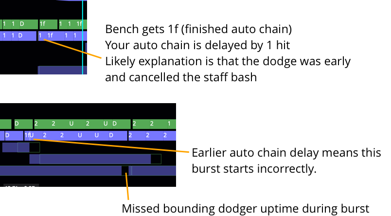

# Moxie

> "I guide others to a treasure I cannot possess"

Tells you some of what you're doing wrong as various Guild
Wars 2 classes. See below for a detailed list of class
support.

This is pre-alpha code guaranteed to contain more bugs than all of Maguuma.

## Usage

- [Go to the site](https://hobinjk.github.io/moxie/dist/)
- Click upload
- Select EVTC file of a benchmark attempt on local hardrive
- Wait for parsing
- Cry

## Interpreting the timeline

The timeline consists of a series of skills and buffs represented as
rectangles. Weapon skill rectangles have their number 1-5, heals marked as H,
utilities as U, and elites as E (engineers and firebrands have their own
special labels too). To view the full skill name mouse over the rectangle.

Comparing your casts to the bench casts you can view any discrepancies. These
are usually downtime, accidental skills, or cancelled casts. An example of
power daredevil advice possible with this tool is below:

## Minor notes
You can also upload a gameplay video so you can see your mistakes in glorious
360p. At least I recommend scaling down your video because I didn't optimize
anything anywhere. If you select an Elite Insights HTML file moxie will try to
parse it but half the buffs are missing so it won't be able to yell at you as
much as you deserve.

## Acknowledgements

Thanks to [Elite
Insights](https://github.com/baaron4/GW2-Elite-Insights-Parser) for being an
awesome EVTC parser, [arcdps](https://www.deltaconnected.com/arcdps/) for
generating the EVTC and having comprehensive documentation, [Snow
Crows](https://snowcrows.com/) for most of the benchmark logs, and Kompa for
giving me log files of good weaver gameplay at the start of this project
because otherwise I wouldn't have known what it looks like.

## Specialization support

### Support with some specific feedback
 - Power sword weaver FA/BttH small/large hitbox
 - Domination power Chronomancer
 - Condition boon Chronomancer
 - Power boon Chronomancer
 - Power illusions Chronomancer
 - Power Daredevil
 - Mirage
 - Condition Firebrand
 - Condition quickness Firebrand
 - Power dagger Soulbeast

### Partial support with benchmark log
 - Condition Berserker with and without banners
 - Power Berserker with and without banners
 - Condition Chronomancer
 - Power Quickness Chronomancer with greatsword and with focus
 - Condition Daredevil
 - Condition Deadeye
 - Rifle Deadeye
 - Dragonhunter
 - Power quickness Firebrand
 - Boon Herald
 - Condition Holosmith
 - Reaper
 - Alacrity Renegade
 - Condition Kalla Renegade
 - Condition Shiro Renegade
 - Power Tempest
 - Condition Sword Weaver
 - Condition Dagger Weaver
 - Power Staff Weaver
 - Scourge
 - Banner Spellbreaker
 - Condition Soulbeast

### Unsupported, recent logs welcome!
 - Dagger Deadeye
 - Condition Engineer
 - Banner Warrior
